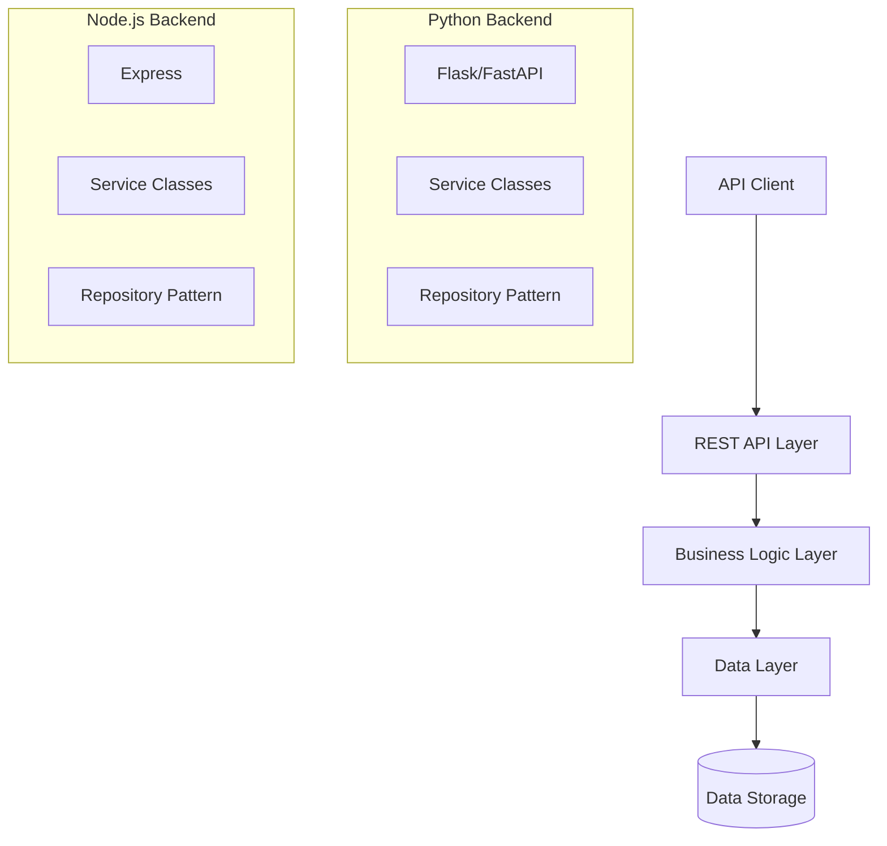
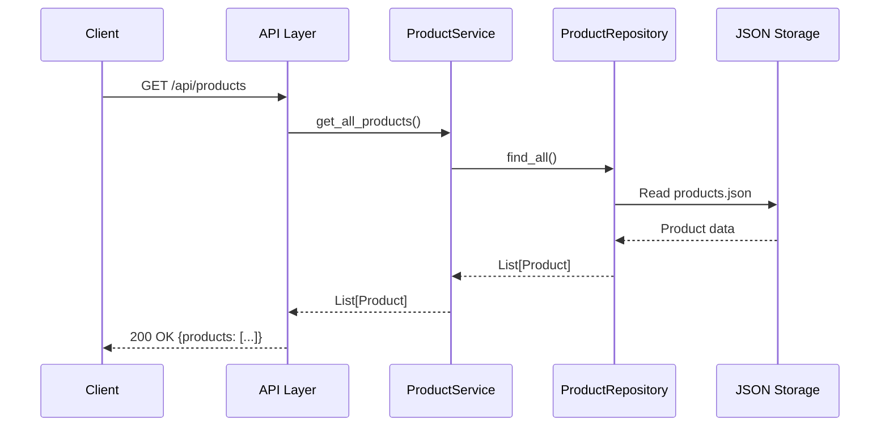
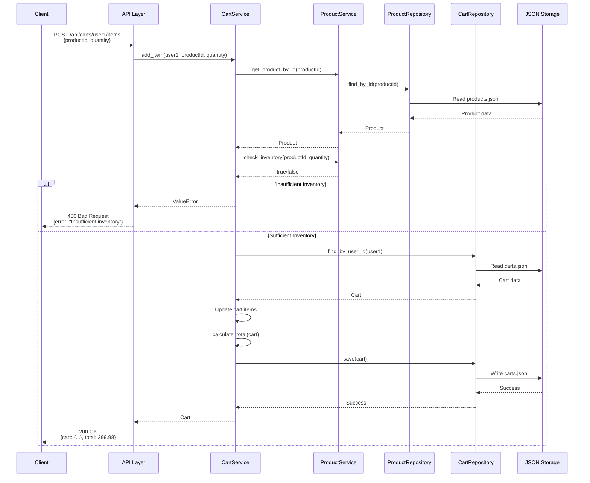
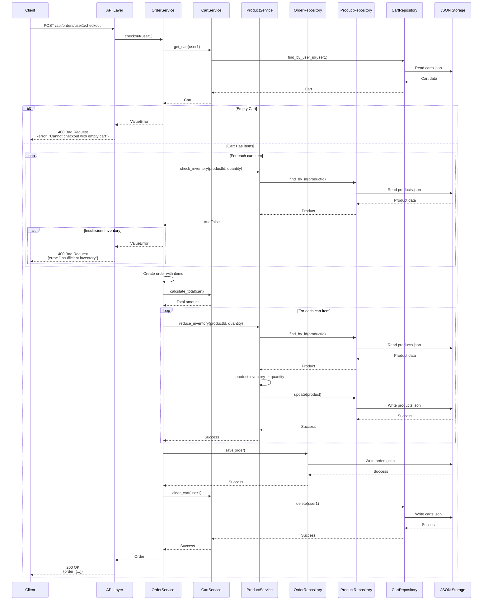
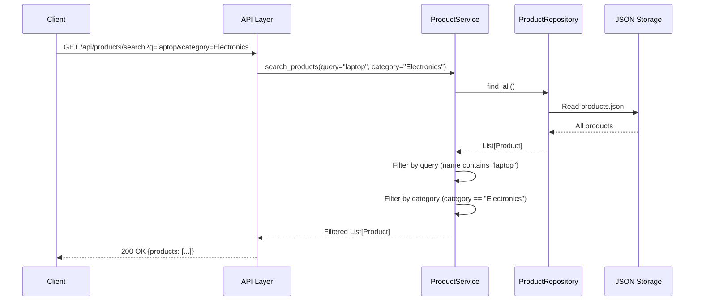
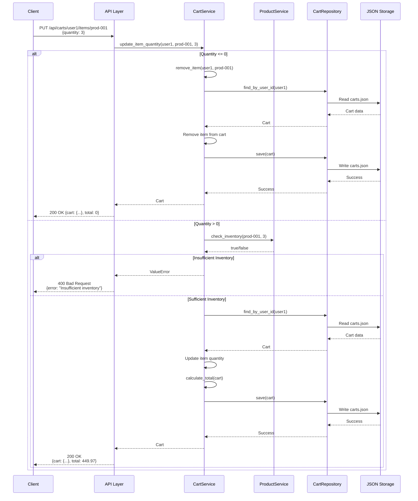
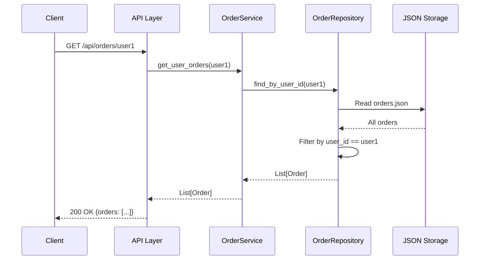

# Design Document: Shopping Cart Application

## Overview

The Shopping Cart Application is a REST API backend system that provides e-commerce shopping cart functionality. The system will be implemented in both Python and Node.js, offering identical functionality through a consistent API contract. The architecture follows a layered approach with clear separation between API endpoints, business logic, and data persistence.

The application supports product catalog browsing, cart management, inventory validation, checkout processing, and order history tracking. Sample data will be provided for testing and demonstration purposes.

## Architecture

### High-Level Architecture



### Layered Architecture

1. **API Layer**: Handles HTTP requests/responses, request validation, and routing
2. **Business Logic Layer**: Implements core shopping cart operations, inventory management, and checkout logic
3. **Data Layer**: Manages data persistence and retrieval using repository pattern
4. **Storage Layer**: File-based JSON storage for products, carts, users, and orders

### Technology Stack

**Python Backend:**
- Framework: Flask or FastAPI
- Data validation: Pydantic
- Storage: JSON files with file locking for concurrency

**Node.js Backend:**
- Framework: Express
- Data validation: Joi or Zod
- Storage: JSON files with proper async file operations

## Sequence Diagrams

### 1. Browse Products Flow



### 2. Add Item to Cart Flow



### 3. Checkout Flow



### 4. Search Products Flow



### 5. Update Cart Item Quantity Flow



### 6. Get Order History Flow



## Components and Interfaces

### 1. API Endpoints

All endpoints return JSON responses and use standard HTTP status codes.

#### Product Endpoints

```
GET /api/products
Response: { products: [Product] }

GET /api/products/:id
Response: { product: Product }

GET /api/products/search?q=<query>&category=<category>
Response: { products: [Product] }
```

#### Cart Endpoints

```
GET /api/carts/:userId
Response: { cart: Cart, total: number }

POST /api/carts/:userId/items
Body: { productId: string, quantity: number }
Response: { cart: Cart, total: number }

PUT /api/carts/:userId/items/:productId
Body: { quantity: number }
Response: { cart: Cart, total: number }

DELETE /api/carts/:userId/items/:productId
Response: { cart: Cart, total: number }

DELETE /api/carts/:userId
Response: { message: string }
```

#### Order Endpoints

```
POST /api/orders/:userId/checkout
Response: { order: Order }

GET /api/orders/:userId
Response: { orders: [Order] }

GET /api/orders/:userId/:orderId
Response: { order: Order }
```

### 2. Business Logic Components

#### ProductService

Manages product catalog operations:

```python
class ProductService:
    def get_all_products() -> List[Product]:
        """Retrieve all products from catalog"""
        
    def get_product_by_id(product_id: str) -> Optional[Product]:
        """Retrieve a single product by ID"""
        
    def search_products(query: str, category: str) -> List[Product]:
        """Search products by name or category"""
        
    def check_inventory(product_id: str, quantity: int) -> bool:
        """Verify if sufficient inventory exists"""
        
    def reduce_inventory(product_id: str, quantity: int) -> None:
        """Reduce inventory after order completion"""
```

#### CartService

Manages shopping cart operations:

```python
class CartService:
    def get_cart(user_id: str) -> Cart:
        """Retrieve user's cart"""
        
    def add_item(user_id: str, product_id: str, quantity: int) -> Cart:
        """Add item to cart or update quantity if exists"""
        
    def update_item_quantity(user_id: str, product_id: str, quantity: int) -> Cart:
        """Update quantity of cart item"""
        
    def remove_item(user_id: str, product_id: str) -> Cart:
        """Remove item from cart"""
        
    def clear_cart(user_id: str) -> None:
        """Remove all items from cart"""
        
    def calculate_total(cart: Cart) -> float:
        """Calculate total price for all cart items"""
```

#### OrderService

Manages checkout and order operations:

```python
class OrderService:
    def checkout(user_id: str) -> Order:
        """Process checkout and create order"""
        
    def get_user_orders(user_id: str) -> List[Order]:
        """Retrieve all orders for a user"""
        
    def get_order_by_id(user_id: str, order_id: str) -> Optional[Order]:
        """Retrieve a specific order"""
```

### 3. Data Layer Components

#### Repository Pattern

Each entity has a repository for data access:

```python
class ProductRepository:
    def find_all() -> List[Product]
    def find_by_id(product_id: str) -> Optional[Product]
    def update(product: Product) -> None
    
class CartRepository:
    def find_by_user_id(user_id: str) -> Optional[Cart]
    def save(cart: Cart) -> None
    def delete(user_id: str) -> None
    
class OrderRepository:
    def save(order: Order) -> None
    def find_by_user_id(user_id: str) -> List[Order]
    def find_by_id(order_id: str) -> Optional[Order]
```

## Data Models

### Product

```python
{
    "id": "string (UUID)",
    "name": "string",
    "description": "string",
    "price": "number (positive)",
    "category": "string",
    "inventory": "integer (non-negative)"
}
```

### Cart

```python
{
    "userId": "string",
    "items": [CartItem],
    "createdAt": "ISO 8601 timestamp",
    "updatedAt": "ISO 8601 timestamp"
}
```

### CartItem

```python
{
    "productId": "string",
    "quantity": "integer (positive)",
    "priceAtAdd": "number (snapshot of price when added)"
}
```

### Order

```python
{
    "id": "string (UUID)",
    "userId": "string",
    "items": [OrderItem],
    "total": "number",
    "createdAt": "ISO 8601 timestamp",
    "status": "string (completed)"
}
```

### OrderItem

```python
{
    "productId": "string",
    "productName": "string (snapshot)",
    "quantity": "integer (positive)",
    "priceAtPurchase": "number (snapshot)"
}
```

### User

```python
{
    "id": "string (UUID)",
    "name": "string",
    "email": "string"
}
```

## Sample Data Structure

The application will include sample data files:

**products.json**: 20+ products across categories (Electronics, Clothing, Books, Home & Garden)
- Mix of in-stock and low-stock items
- Price range: $5 - $500
- Categories: Electronics, Clothing, Books, Home & Garden, Sports

**users.json**: 3 sample users
- User IDs: user1, user2, user3
- Each with name and email

**carts.json**: Initially empty, populated during runtime

**orders.json**: Initially empty, populated during runtime


## Correctness Properties

A property is a characteristic or behavior that should hold true across all valid executions of a system—essentially, a formal statement about what the system should do. Properties serve as the bridge between human-readable specifications and machine-verifiable correctness guarantees.

### Property 1: Product Retrieval by ID

*For any* valid product ID in the catalog, retrieving that product should return the product with matching ID and all its attributes.

**Validates: Requirements 1.2**

### Property 2: Product Response Completeness

*For any* product retrieved from the API, the response should contain name, description, price, and inventory fields.

**Validates: Requirements 1.3**

### Property 3: Product Search Accuracy

*For any* search query and category filter, all returned products should either have names containing the query string or belong to the specified category.

**Validates: Requirements 1.4**

### Property 4: Adding Item to Cart

*For any* cart and any product with valid quantity, adding the product should result in the cart containing that product with the specified quantity.

**Validates: Requirements 2.1**

### Property 5: Adding Existing Item Updates Quantity

*For any* cart already containing a product, adding more of that product should increase the existing item's quantity rather than creating a duplicate cart item.

**Validates: Requirements 2.2**

### Property 6: Cart Response Completeness

*For any* cart retrieved from the API, the response should contain all cart items with their product details and quantities.

**Validates: Requirements 2.4**

### Property 7: Cart Total Calculation

*For any* cart, the calculated total should equal the sum of (quantity × price) for all cart items.

**Validates: Requirements 2.5, 3.4**

### Property 8: Update Cart Item Quantity

*For any* cart item, updating its quantity to a new valid value should result in the cart reflecting that new quantity for the item.

**Validates: Requirements 3.1**

### Property 9: Remove Item from Cart

*For any* cart containing a product, removing that product should result in the cart no longer containing that product.

**Validates: Requirements 3.3**

### Property 10: Clear Cart

*For any* cart, clearing it should result in an empty cart with zero items and zero total.

**Validates: Requirements 3.5**

### Property 11: Inventory Validation on Add

*For any* product and quantity, if the quantity exceeds available inventory, attempting to add it to a cart should fail with an error response.

**Validates: Requirements 4.1, 4.2**

### Property 12: Inventory Validation on Update

*For any* cart item quantity update, if the new quantity exceeds available inventory, the update should fail with an error response.

**Validates: Requirements 4.3**

### Property 13: Inventory Deduction After Checkout

*For any* successful order, the inventory for each ordered product should decrease by the ordered quantity.

**Validates: Requirements 4.5**

### Property 14: Checkout Inventory Validation

*For any* cart, if any cart item quantity exceeds its product's available inventory, checkout should fail with an error response.

**Validates: Requirements 5.2, 5.3**

### Property 15: Order Creation from Cart

*For any* cart with valid inventory, successful checkout should create an order containing all cart items with their quantities and prices.

**Validates: Requirements 5.4**

### Property 16: Cart Cleared After Checkout

*For any* successful checkout, the user's cart should be empty immediately after order creation.

**Validates: Requirements 5.5**

### Property 17: Order Confirmation Completeness

*For any* created order, the response should contain order ID and total amount.

**Validates: Requirements 5.6**

### Property 18: Cart Persistence

*For any* cart with items, after performing cart operations and retrieving the cart again, all items should be present with correct quantities.

**Validates: Requirements 6.2, 6.3, 6.4**

### Property 19: Cart Isolation Between Users

*For any* two different users, adding items to one user's cart should not affect the other user's cart.

**Validates: Requirements 6.5**

### Property 20: Order Response Completeness

*For any* order retrieved from the API, the response should contain order ID, date, items, quantities, and total amount.

**Validates: Requirements 7.2**

### Property 21: Order Retrieval by ID

*For any* created order, retrieving it by its order ID should return the same order with all its details.

**Validates: Requirements 7.3**

### Property 22: Order Persistence

*For any* created order, it should remain retrievable with unchanged details even after subsequent operations.

**Validates: Requirements 7.4**

### Property 23: Order Item Price Snapshot

*For any* order, the prices in order items should reflect the prices at the time of purchase, not current product prices.

**Validates: Requirements 7.5**

### Property 24: Data Reset Idempotence

*For any* system state, resetting to sample data should produce the same initial state regardless of previous operations.

**Validates: Requirements 8.5**

### Property 25: JSON Response Format

*For any* API response, the response body should be valid JSON that can be parsed without errors.

**Validates: Requirements 9.3**

### Property 26: Backend Behavioral Equivalence

*For any* API request, executing it against the Python backend and the Node.js backend should produce equivalent responses (same status codes, same data structure, same business logic results).

**Validates: Requirements 9.6**

### Property 27: Error Response Status Codes

*For any* failed API request, the response should have an appropriate non-2xx HTTP status code.

**Validates: Requirements 10.1**

### Property 28: Error Response Format

*For any* error response, it should be valid JSON containing an error message field.

**Validates: Requirements 10.2**

### Property 29: Not Found Returns 404

*For any* request for a non-existent resource (product ID, order ID, etc.), the response should have a 404 status code.

**Validates: Requirements 10.3**

### Property 30: Invalid Data Returns 400

*For any* request with invalid data (negative quantities, missing required fields, invalid formats), the response should have a 400 status code with validation details.

**Validates: Requirements 10.4**

### Property 31: Internal Errors Return 500 Without Details

*For any* internal server error, the response should have a 500 status code and should not expose internal implementation details or stack traces.

**Validates: Requirements 10.5**

### Property 32: Data Persistence Across Restarts

*For any* data (products, carts, orders, users) created before a system restart, the data should be retrievable after restart with all details unchanged.

**Validates: Requirements 11.1, 11.2, 11.3, 11.4, 11.5**

## Error Handling

### Error Categories

1. **Validation Errors (400)**
   - Invalid product ID format
   - Negative or zero quantities
   - Missing required fields
   - Invalid data types

2. **Not Found Errors (404)**
   - Product ID does not exist
   - Order ID does not exist
   - User has no cart

3. **Business Logic Errors (400)**
   - Insufficient inventory
   - Empty cart at checkout
   - Quantity exceeds maximum allowed

4. **Internal Errors (500)**
   - File system errors
   - Data corruption
   - Unexpected exceptions

### Error Response Format

All errors return JSON with consistent structure:

```json
{
    "error": {
        "code": "ERROR_CODE",
        "message": "Human-readable error message",
        "details": {} // Optional additional context
    }
}
```

### Error Handling Strategy

- Validate all inputs at API layer before processing
- Use try-catch blocks to handle unexpected errors
- Log errors internally with full details
- Return sanitized error messages to clients
- Never expose stack traces or internal paths
- Use appropriate HTTP status codes consistently

## Testing Strategy

### Dual Testing Approach

The application will use both unit testing and property-based testing as complementary approaches:

- **Unit tests**: Verify specific examples, edge cases, and error conditions
- **Property tests**: Verify universal properties across all inputs
- Both are necessary for comprehensive coverage

### Unit Testing

Unit tests focus on:
- Specific examples demonstrating correct behavior
- Edge cases (empty carts, zero quantities, boundary values)
- Error conditions (invalid inputs, not found scenarios)
- Integration points between components

Unit tests should be targeted and not overly numerous, as property-based tests handle broad input coverage.

### Property-Based Testing

**Framework Selection:**
- Python: Use `hypothesis` library
- Node.js: Use `fast-check` library

**Configuration:**
- Each property test MUST run minimum 100 iterations
- Each test MUST reference its design document property
- Tag format: `Feature: shopping-cart-application, Property {number}: {property_text}`

**Property Test Coverage:**
- Each correctness property listed above MUST be implemented as a single property-based test
- Tests should generate random valid inputs (products, carts, quantities, user IDs)
- Tests should verify the property holds across all generated inputs
- Tests should catch edge cases through randomization

**Example Property Test Structure (Python):**

```python
from hypothesis import given, strategies as st

# Feature: shopping-cart-application, Property 7: Cart Total Calculation
@given(cart=cart_strategy())
def test_cart_total_calculation(cart):
    """For any cart, total should equal sum of (quantity × price) for all items"""
    calculated_total = cart_service.calculate_total(cart)
    expected_total = sum(item.quantity * item.price for item in cart.items)
    assert calculated_total == expected_total
```

### Test Organization

- Unit tests in `tests/unit/` directory
- Property tests in `tests/properties/` directory
- Integration tests in `tests/integration/` directory
- Separate test suites for Python and Node.js backends
- Shared test data generators for consistency

### Testing Both Backends

Property 26 (Backend Behavioral Equivalence) requires testing both implementations:
- Run the same test suite against both backends
- Use contract testing to verify API compatibility
- Generate random requests and verify both backends produce equivalent responses
